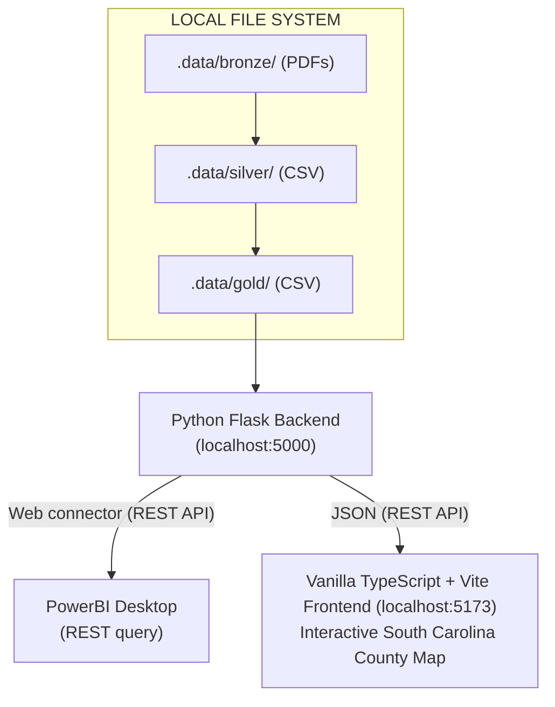

# Proposal: Local Demo

**Target Repositories:** `opencourts-demo` 

---

## 1. Executive Summary & Purpose
To foster **low-friction participation (`GC-5`)** and deliver an early, tangible win, this proposal introduces a **downscoped, local-only prototype** of the **OpenCourts.fyi** MVP architecture defined in our [Software Requirement Specification](../software-requirements-specification.md) and [Software Design Document](../software-design-document.md) . This initiative focuses on a single end-to-end legal analytics workflow: **South Carolina Probate Court Clearance Rates**.

## 2. Key Objectives:
1. **Demonstrate End-to-End Value:** Provide an interactive, visual proof-of-concept showing raw court data transformed into actionable public insights.
2. **Lower Barrier to Getting Started:** Volunteers have unpredictable availability and require issues that are well-defined and ready-to-work in small amounts of hours. If an issue requires a lot of upfront research or takes days or weeks to implement, it's not ready and requires more breakdown.
3. **Architectural Parity:** Ground the local prototype strictly in OpenCourts SRS/SDD standards—specifically the **Medallion Data Lineage (`FR-10A`)**, **CSV and JSON access (`FR-4`)**, and **Usable by Non-Technical Stakeholders(`NFR-3`)**

## 3. Wireframe

### 3.1 Initial Non-Interactive Prototype
Non-Interactive Prototype consisting of vanilla Typescript (do not use React, Angular or another framework). Display the full range
of data in the map and table. Do not style - Plain HTML5 only plus D3.js. Plain typescript. Prevent user from interacting with the map and table for now.

```
          SC County Clearance Rates         

  Legend: Green=100%  Yellow=80-99.9%  Red=<80%

     <Start Month Year> to <End Month Year >   
+---------------------------------------------+
|                                             |
|                                             |
|                                             |
|               Choropleth Map                |
|                                             |
|              TopoJSON -> D3.js              |
|                                             |
|                                             |
|                                             |
|                                             |
|                                             |
|                                             |
+---------------------------------------------+
                                               
      County Name        Clearance Rate        
      -----------        --------------        
      CountyA            22%                   
      CountyB            88%                   
      CountyC            104%                  
```

### 3.2 Followon Prototype
We will build interactivity once the backend is designed.

## 4. System Architecture & Component Design

The local prototype consists of four decoupled components operating on `localhost`:



### 4.1 Data Layer (`FR-10A`)
* **Bronze (`.data/bronze/`):** Raw SC court filing and disposition records stored in CSV format.
* **Silver (`.data/silver/`):** Standardized, schema-validated csv files containing cleaned county filings, dispositions, and court levels.
* **Gold (`.data/gold/`):** Aggregated data 


### 4.2 Web API Layer (`FR-4`)
A lightweight Python Flask REST API (`http://localhost:5000`) providing:
* `GET /api/<tier>`: Tier in `[gold, silver, bronze]`, returns file listing in the specified folder.
* `GET /api/<tier>/download`: Downloads a `filename` in specified folder using `multipart\form`.

> [!Note]
> Security concern: make sure to test for escaping the folder.

## 3.4 Algorithms
Calculating Clearance Rate %

Clearance rate is a simple mean of adding up all the dispositions (closed files) and all of the filings (newly opened files) over a given unit of time, then finding their ratio. Let's calculate this metric on the frontend since the burden is lightweight for modern browsers

*Illustrative figures; clearance rates are for the full January–March period.*

| County | Jan Filed | Jan Disposed | Feb Filed | Feb Disposed | Mar Filed | Mar Disposed | Clearance rate |
|---|---:|---:|---:|---:|---:|---:|---:|
| Charleston | 390 | 360 | 400 | 380 | 410 | 400 | 95% |
| Greenville | 270 | 290 | 280 | 300 | 300 | 328 | 108% |
| Richland | 340 | 270 | 350 | 280 | 360 | 290 | 80% |

Clearance rate is calculated as total cases closed divided by total cases opened, multiplied by 100. For Charleston, the three-month totals are 1,140 closed and 1,200 opened, so its clearance rate is 1,140 ÷ 1,200 × 100 = **95%**.

More generally, clearance rate can be calculated from monthly metrics using:
$$
\text{Clearance Rate (\%)} =
\left(
\frac{\sum_{m=\text{Start Month}}^{\text{End Month}} \text{Dispositions}_m}
{\sum_{m=\text{Start Month}}^{\text{End Month}} \text{Filings}_m}
\right)
\times 100
$$

### 3.4 Analytics & Exploration Layer
* **PowerBI Desktop:** Allows non-programmers to ingest files directly or query the Flask REST API. Use a web connect to pull the data and show that updates to the data are reflected in PowerBI.

### 3.5 Visualization Layer (`FR-17`, `NFR-3`)
* **TypeScript + Vite App:** Interactive choropleth map rendering South Carolina's 46 counties color-coded by clearance rate. Data is visualized using a Topojson file. Use three colors: 
    * Green (>= 99.9%) 
    * Yellow (80 - 99.8%) 
    * Red (<80%)
* Hover tooltip display:
    * county name
    * total filings
    * total dispositions
    * clearance rate percentage
* Table displaying `[County Name, Case Count (Avg), and ClearanceRate (Avg)]`


---

## 4. Workitem Roadmap
### Create the initial frontend
* **Issue 1.1:** Establish Agents.md for repo
* **Issue 1.2:** Develop tests for all existing python code
* **Issue 1.3:** Implement automated testing on push. 
* **Issue 1.4:** Divide the repo into `frontend` and `backend` folders.
* **Issue 1.5:** Initialize the frontend typescript project with vite and typescript (hello, world display)
* **Issue 1.6:** Render the initial webpage frontend using canned data. Use canned clearance data already in JSON and render SC choropleth map.
* **Issue 1.7:** Accessibility / enhance for screen reader (tests please!)
* **Issue 1.8:** Minified TopoJSON


### Flask Web API 
* **Issue 2.1:** Develop Flask REST server with directory browsing endpoints for Bronze, Silver, and Gold folders.
* **Issue 2.2:** Develop web api download of a file.
* **Issue 2.3:** Connect frontend to the REST server
* **Issue 2.4:** Create a 5-minute setup guide for querying local CSV/REST data inside PowerBI Desktop `[documentation]`.
* **Issue 2.5:** Add interactivity: ability to select start and end dates for data
* **Issue 2.6:** Add interactive tooltip displaying county name and clearance rate %.
* **Issue 2.7:** Add interactivity selectable map ties to selectable table


---

## 5. Guidelines

1. Simple is better than complicated
2. Functional is better than stylish
2. Unit tests and integration tests run automatically
3. All code is linted
4. Any volunteer is capable of running the demo
5. Visual impairment is not a barrier to use